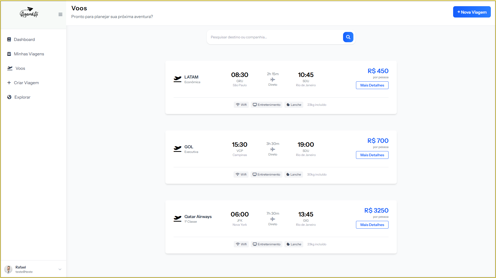
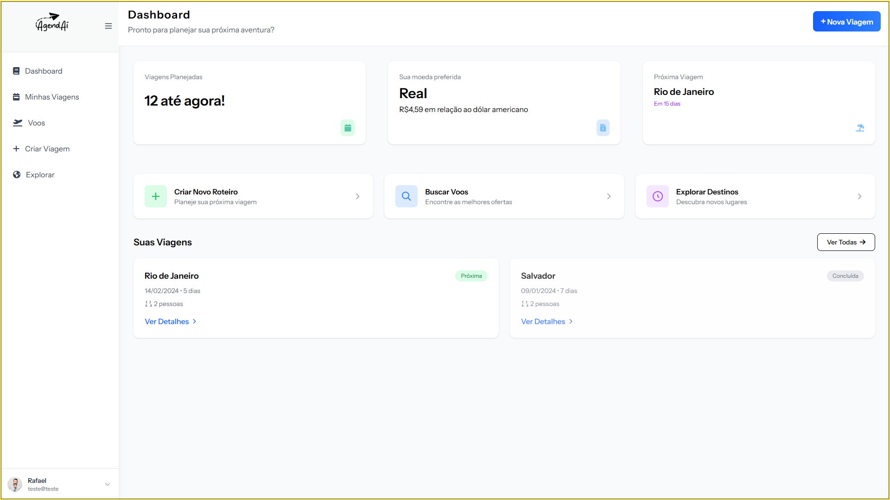

<!-- Logo do projeto -->

  

<h1 align="center">🌍 AgendAí – Planeje Sua Viagem dos Sonhos</h1>

  <strong>Projeto de TCC – Etec João Belarmino de Amparo</strong> 
  <em>Curso Técnico em Informática • 2025</em>

  <strong>Integrantes:</strong> Matheus Porcaro • Michel Mian • Nara Stachetti • Rafael Fante • Samy Maiorini

---

## 📌 Sobre o Projeto

**AgendAí** é um sistema web voltado para o planejamento de viagens, oferecendo uma experiência completa para usuários que desejam montar seus roteiros de forma prática, organizada e personalizada. O sistema centraliza informações essenciais como hospedagem, passagens, câmbio, clima, atrações e cronograma, evitando a dispersão de dados e o estresse durante o planejamento.

---

## 💡 Problematização

Atualmente, planejar uma viagem exige buscar dados em múltiplas fontes: hotéis, restaurantes, pontos turísticos, transporte, moeda, clima, entre outros. Isso torna o processo **demorado, confuso e desgastante**, podendo frustrar as expectativas do viajante.

---

## 🎯 Objetivo

### 🎯 Objetivo Geral

Desenvolver um **sistema web completo e intuitivo**, capaz de auxiliar no **planejamento e organização de viagens**, servindo como uma central de recursos turísticos.

### 📌 Objetivos Específicos

- 🗺️ **R1 – Mapa com Pontos de Relevância**  
  Visualização interativa de hotéis, restaurantes, atrações e casas de câmbio.

- 🏨 **R2 – Comparativo de Hotéis**  
  Informações detalhadas e comparação entre hospedagens da região.

- ✈️ **R3 – Listagem de Voos e Preços**  
  Exibição de voos com preços, horários, companhias e detalhes do trajeto.

- 📆 **R4 – Cronograma da Viagem (Day-by-Day)**  
  Ferramenta para criar um roteiro diário com horários, destinos e orçamento.

- 💱 **R5 – Câmbio da Moeda Turística**  
  Cotação atualizada de moedas internacionais com gráficos e conversão.

- 📚 **R6 – Informações do Destino**  
  Curiosidades, cultura local, eventos e notícias sobre o local visitado.

- 🌤️ **R7 – Previsão do Clima**  
  Dados meteorológicos detalhados por dia e período da viagem.

---

## 🛠️ Tecnologias Utilizadas

- HTML5 / CSS3  
- JavaScript  
- PHP
- Laravel / Blade
- MySQL  
- APIs
- Figma
- Node.Js
- Tailwind

---

## 📈 Status do Projeto

📌 **Em desenvolvimento**  

---

## 📝 Licença

Este projeto foi desenvolvido como parte do Trabalho de Conclusão de Curso (TCC) na Etec João Belarmino de Amparo. Uso acadêmico, sem fins lucrativos.

---

## 📷 Capturas de Tela

  

---
